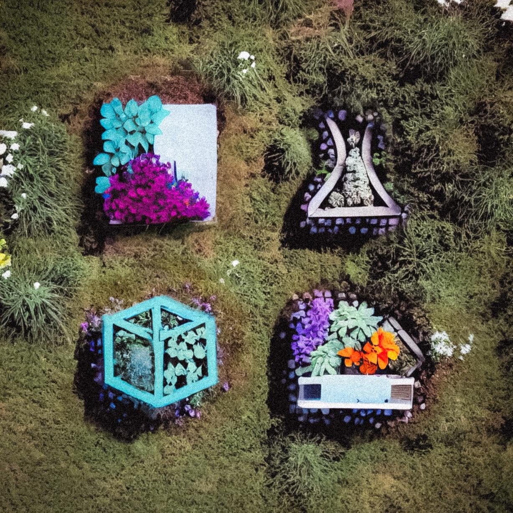
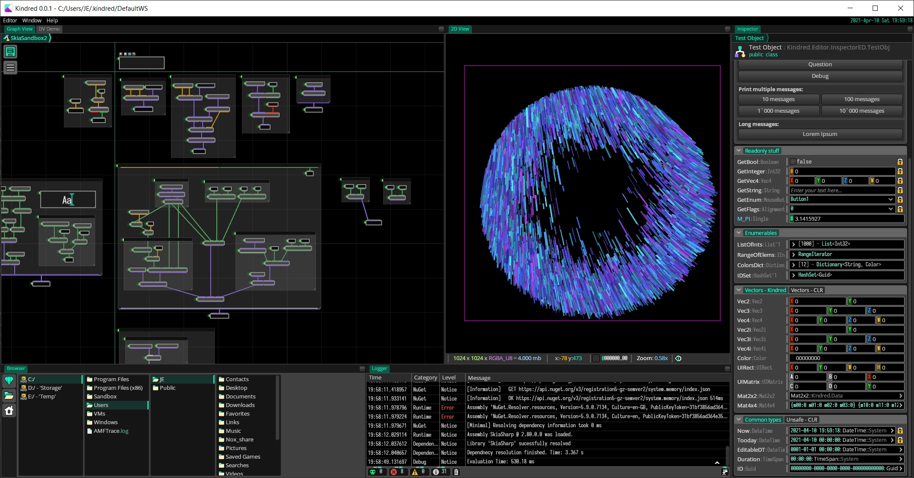
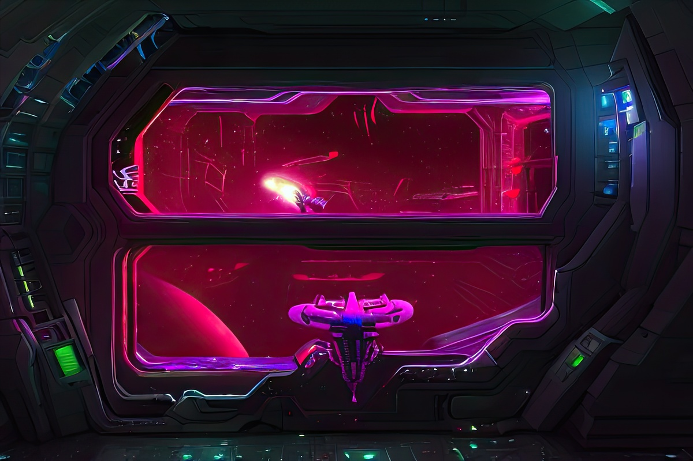
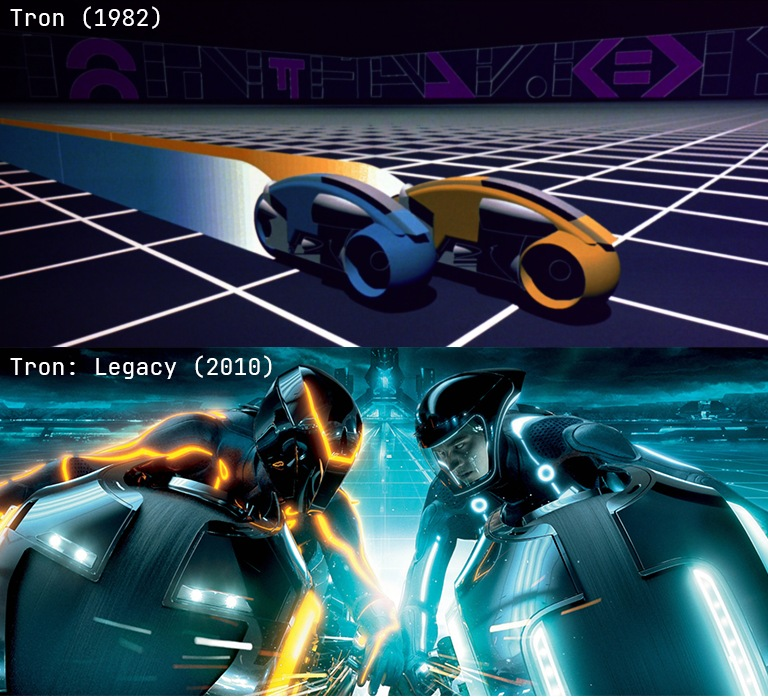

# Kindred. Legacy. Нейросети. Ты с нами?

Эта статья о том, как мы хотели перевернуть индустрию создания Digital контента для кино и игр. Разрабатывали вундервафлю 4 года пропустив стадию Customer Development'a. Выгорели. Отдохнули. И решили пойти дальше, усвоив очень печальный и дорогой урок.  

И вот, на горизонте маячит очередная технологическая революция, которая вскоре изменит индустрию создания Digital Content'a раз и навсегда...  

Если интересно, добро пожаловать под кат.

-----

# Kindred

Kindred - проект который изначально задумывался, как универсальное средство для художников, и прочих Digital Special'истов занятых в областях производства контента.

Идея была проста - давайте объединим все возможные тулзы в одном "доме", свяжем всё во едино языком визуального программирования, и дадим пользователям удобный пакетный менеджер.  

Единый дом, нужен был для решения проблемы связности данных и функционала программы. Если пользователь собирает модель в Blender за счёт модификаторов или Geometry-Node'ов, рисуя текстуры в Substance Painter'е он не может вносить правки в модель прям в Painter'е. Он должен вернуться в блендер, реекспортнуть модель, перезапечь карты (нормалей, кривизны, AO), и если повезёт, маски на модели не сползут, и можно будет сразу продолжать рисовать материалы. В общем процесс не быстрый, не простой, в абсолютном большинстве случаев ручной, и как правило влечёт за собой ряд ошибок и трудностей. Если бы текстуры можно было рисовать в Blender'е так же как в Painter'e, проблем с обменом данными не было бы. По этому Kindred ставил перед собой целью, усидеть на всех стульях одновременно, чтобы избежать проблем при внесении правок на разных этапах производственного пайплайна.  

Визуальный язык программирования - универсальный супер клей между инструментами. Мало иметь просто большой набор функций, их нужно объединять в последовательности, чтобы автоматизировать процесс работы над контентом. Работа художника в большинстве случаев состоит из одних и тех же повторяющихся процессов, в которых рождаются произведения. И каждый запуск такого "процесса", в большинстве случаев сводится к рутине, часть который можно автоматизировать, чтобы рутина сводилась к наитию 1 кнопки. Автоматизация очень важна, так как позволяет экономить драгоценное время художника. Если художник имеет хорошие, годные инструменты, он может создать больше артов за единицу времени. Визуальный язык для автоматизации очень хороший инструмент, так как за счёт него можно определять логику работы инструмента, при этом не опускаясь слишком глубоко в детали синтаксиса, семантики, правил преобразования, и т.п. Ты просто передаёшь данные между обработчиками и выводишь наружу нужные тебе параметры в виде крутилок.

И вишенкой на торте является система управления зависимостями. Зависимости в смысле сторонних библиотек, очень распространённая сущность в мире программирования. Трудно себе представить чтобы в современном мире была бы такая технология, в которой содержалась бы функция или класс на все случаи жизни. Хотя есть конечно прецеденты в виде 1C, Sap, и т.п. но мало у кого повернётся язык назвать их General Purpouse инструментами. В мире контентного продакшна же всё с точностью да на оборот, каждый первый инструмент пытается вобрать в себя максимально возможноe кол-во функций. Заменителем системы управления зависимости в Production среде является возможность подключения плагинов. Правда, заменой это назвать сложно. Расширение за счёт плагинов обладает только одним полезным свойством - функционал программы можно расширить. А такие вещи как версионирование, доставка, обновления, конфигурация, активация лицензий, и всё остальное ложится на плечи пользователя. По этому плагинами пользуются только самые продвинутые и требовательные пользователей. С другой стороны плагины частично решают проблемы больших инструментов, а в некоторых случаях являются чуть ли не обязательной составляющей в определённых пайплайнах.

В сумме, это должно было дать возможность реализовать примерно следующий Workflow: от арт директора прилетает задача - собрать сцену с ночным сказочным лесом, в котором светятся деревья, летают мелкие дроны, и где-то вдалеке стоит огромная тарелка от старого радио телескопа. Хорошая такая задача, для среднего отдела художников (8+ человек), которые смогут её выполнить в лучшем случае за полтора месяц, а то и за три. В случае использования Kindred'a это мог бы сделать 1 технический художник за две-три недели. Начал бы он с декомпозиции сцены на составляющие, для каждой подобрал подходящие библиотеки. Подготовил генераторы собирающие сцену, нарендерил бы кучу картинок, и в любой момент мог бы изменить что угодно (модельки дронов, тип листвы на деревьях, цвет свечения деревьев) и ещё бы осталось время на эксперименты.

Звучит как фантастика, не правда ли? Да конечно, оба случая преувеличены, и скрывают под собой ряд допущений о начальных условиях. Если у традиционной студии уже есть готовый контент от прошлых проектов, они бы сделали это не за 1.5-3 месяца а за 1, и меньшим количеством людей. У технического художника же должен быть набор готовых библиотек с генераторами, иначе ему придётся разрабатывать свои. Что уже требует несколько другого уровня компетенции, нежели слаковая сборка сцен на основе готовых библиотек. Однако это на контрасте позволяет почувствовать разницу, которая показывает бОльшую эффективность инструментов имеющих в своей ДНК технологии связанные с автоматизацией. Мир конечно же не чёрно-белый  и таких "чистых" случаев не будет, будет 100500 оттенков, но корреляция к увеличению эффективности точно будет прослеживаться невооружённым глазом. Проблемы же могут возникнуть разве что с реализацией.

# А что там с реализацией?

О текущем состоянии проекта подробно можно почитать тут: https://gitlab.com/kindred-exchange/about-kindred

По прошествии четырёх лет, в моральном плане, проект заглох. О причинах можно рассуждать долго, но основные из них - отсутствие понимания о том, кто и как должен этим пользоваться, какие инструменты в первую очередь разрабатывать, и в целом, относительная сложность разработки подобных инструментов.

Если первые 2 ещё более менее можно эффективно решить просто общаясь с людьми из индустрии, и понять "где у них больше всего болит". То вот с последним уже не всё так радужно, ведь мы хотим конкурировать с уже существующими инструментами гигантами по типу 3dsmax, maya, houdini, substance, blender, и т.д. При таком подходе нужно учитывать, что не все задачи можно решить за счёт автоматизации. Тот же Houdini в нескольких последних мажорных релизах внедряет инструменты для традиционного моделирования. И не с проста. Есть некий принципиальный практический минимум автоматизируемости процессов. Который задаётся тем, что ряд задач всё равно придётся делать руками. И вот тут возникает очень большая и неприятная проблема. Хороший инструмент для ручной работы с данными, будь то для растровой, векторной, 2D или 3D графики, чертовски сложная штука. Которую чертовски сложно сделать за разумное время. И без этой штуки обойтись ни как нельзя. Иначе Kindred будет банально неюзабельным для художника, так как художник != не программист. А вертексы выделять лучше всего руками. Надеяться на безграничную всесильность Community так же не стоит, так как разработать такой инструмент могут не только лишь все, а те кто могут и так уже работают в Autodesk, SideFx, Pixologic или каком-то похожем месте.

И что, на этом всё?

И да, и нет. С одной стороны, мы точно не сможем гоняться по функционалу с традиционными инструментами. Это просто бессмысленно, и беспощадно.

С другой, у нас есть работающая технология на основе которой мы можем собирать Production инструменты. Да и не только Production. Можно делать CAD'ы, дашборды, панели управления станками, небольшие редакторы для ручных видов творчества, и т.п. Нужно лишь найти того кому это нужно. По этому если вас заинтересовала платформа Kindred'a, пишите нам, сделаем вам хороший, годный, удобный инструмент для вашего станка.

Но, есть вариант поинтереснее...

# Будущее за генеративными инструментами

Недавно, в мире компьютерной графики произошла революция. Жмыхнуло на столько сильно, что равнодушным не останется ни один DigitalArtist, Арт-директор, дизайнер, и вообще рисующий человек. А тех кого не жмыхнуло, ещё жмыхнет, как только они об этом узнают, и осознают смысл происходящего.

Суть драмы заключается в появлении супер крутых нейросетей, которые по описанию в виде текста или каляк-маляк из paint'a, генерят картинки очень высокого качества в заданном стиле. А если у человека достаточно времени, дотошности, и желания разбираться в чём-то новом, он становится сверх эффективной единицей по производству контента. При этом, такому человеку особо не нужны инструменты типа Photoshop'a. Во всяком случае они теперь не являются обязательными, но в общем и целом, остаются полезными в качестве простеньких редакторов для склейки картинок и калякания.

На сегодняшний день, хорошо это всё работает только в 2D пространстве картинок. Но, стоит подождать пол года, и туда подъедет 3D, и всех жмыхнет во второй раз. Сейчас мы находимся в моменте когда всё начинает вставать с ног на голову, потому что теперь не нужно оттачивать свои скилы в рисовании годами, чтобы достигать хороших, годных результатов, достаточно просто иметь хороший вкус, и RTX 3060 c 12gb видео памяти под столом. 

Кто-то может возразить что мол, нейросети не могут создать ни чего нового, качество результатов низкое, и вообще они не могут придумать новый стиль. Я отвечу, подождите год другой, и нейросети будут создавать новые стили тысячами за 1 день, качество будет лучше чем сегодня может нарисовать человек, да и просто потому что нет ни каких причин почему это было бы не возможно. По этому, думайте на 2 шага вперёд, тогда картину будет видно целиком.

Ближайшая аналогия в истории компьютерной графики - появление самой компьютерной графики. Когда появились первые компьютеры способные рендерить спец-эффекты, и прочую мультипликацию. Всё быстро поменялось. Студии перестали тратить годы на создание мультфильмов, а в кино стали возможны вещи, которые даже нельзя было представить. 

Стоимость производства упала ниже плинтуса, на рынке появилось огромное кол-во качественного контента, индустрия увеличила капитализацию в разы.

Сейчас происходит нечто похожее, так как уровень необходимых компетенция падает, и войти в мир компьютерной графики гордым креатором, а не потребителем становится проще.

Вместе с тем, появляется потребность в новых инструментах. 

Понятное дело, что Autodesk, Adobe, и ко, будут внедрять у себя новые нейросетевые технологии, впрочем они уже это делают. Дистрибутивы бухнут, внедрённые модели устаревают, программи открываются всё медленее и медленее.

Так же есть ряд достаточно удачных примеров того, как казалось бы на закостеневшем рынке вырастали такие годные продукты как Figma, Substance (до покупки Adobe), и т.п.

Kindred, мы начали разрабатывать из-за того что у нас был не проходящий зуд в самых неудобных местах от использования "Industry Grade" инструментов. И был он на столько велик, что мы решили сделать свой, и навсегда от него избавиться. Результат вы уже знаете, но вот "отсутсвие зуда", в днк у Kindred'a осталось. Лейтмотивом через всю разработку летела лёгкость, простота, скорость, эффективность и удобство для пользователя. В то время как IDE в которой разрабатывался Kindred отжирала 4 gb оперативки, и загружала процессор на 60% при написании коментариев, Kindred при работе над визуальными программами с той же базой библиотек, потреблял 240mb, а загрузить процессор больше чем на 15% нужно было ещё постараться. Да и в целом всё работало на ноутбуке из 2014 года купленным за 15k рублей. Короче говоря, на качество конечного продукта мы не забивали, у нас нет Legacу, всё супер лёгкое и супер быстрое, и я сделаю всё, чтобы оно таким оставалось.

# NeuroMania

Ок, потребность в инструменте, вроде есть. В нашем распоряжении есть заготовка для такого инструмента.

Называть будем его NeuroMania. Сам инструмент, должен представлять собой песочницу для около-технического художника, которая будет базироваться на трёх столпах Kindred'a : всеядность, процедурность, расширяемость.

Целью проекта является предоставление доступа к большинству актуальных нейросетей, и прочим генеративным технологиям и алгоритмам, которые можно применить в сферах производства развлекательного контента, автоматизированного проектирования, и т.д.

В первый релиз нейромании войдут инструменты для:

- отображения 2D данных
- выделения областей на изображениях (квадрат, область, рисунок)
- инструментария для обрезки и подготовки входных данных для нейросети,
- система логгирования запросов к нейросетям (чтобы иметь возможность повторить любую генерацию)
- пакетный менеджер, с помощью которого можно будет получать обученные модели, заготовки проектов, проекты целиком, обучающие материалы, примеры использования нейросетей и т.п.

В последующем будет здорово добавить инструменты для:

- отображения 3D данных
- выборки/выделения 3D данных
- подготовки датасетов для обучения
- поддержку notebook'ов прям в Editor'e 
- интеграции с вычислительными GPU облаками
- запуск вычислений на другом мощьном компьютере

Отдельно хочется поговорить про лицензию и модель распространения. Так как денег у нас не очень много, а кушать хочется, есть большой соблазн сделать из этой штуки коммерческий продукт. Однако, это крайне недальновидное решение, ограничивающее развитие данной области, и значительно ограничивающее множество потенциальных пользователей. По этому NeuroMania, и всё то, что пользователь сможет запускать у себя локально на компьютере, в обязательном порядке должно быть выпущено под OpenSource лицензией, по типу MIT или Apache.

OpenSource хорошо себя зарекомендовал, как ультимативный метод для создания удобных для конечного пользователя инструментов которые сегодня применяются повсеместно. Ибо люди делают как для себя, и на века. Так же это повышает шанс того, что крутые спецы будут тратить своё время на развитие проекта. 

По этому, этот проект будет опенсурсным.

Со стороны Community хотелось бы увидеть людей, которые знают как готовить Python, и ML'ный код с прикладной точки зрения. С UI'ками мы легко справимся сами, а вот со знаниями в области Python'а у нас явный провал. Так же мы прекрасно понимаем, что CLR не умеет запускать полноценный Python, по этому ту часть, что связана с загрузкой и запуском моделей нужно будет реализовать в виде сервера на Python, и организовать быстрый линк между фронтом в виде Editor'a и сервером. Либо, можем рассмотреть какой-то другой вариант, главное чтобы работало хорошо и быстро.

Помимо прямой помощи, возможны и другие варианты. Разработка Kindred'a и всего что с ним связано происходит благодаря компании [TiltShift](https://tiltshift.xyz). Тут люди занимаются аутсорсной разработкой интерактивных приложений и игр на Unity. По этому если у вас есть проект, который нужно сделать с нуля или допилить напильником. Приходите к нам, мы хорошо готовим Unity.

В общем, хотелось бы услышать мнение IT-шного и DititalArt сообществ по поводу данного проекта, и пригласить всех желающих поучаствовать, помочь с разработкой, и обсудить данный проект.

Общаться будем тут: 

Discrod: https://discord.gg/aaaaaaa
